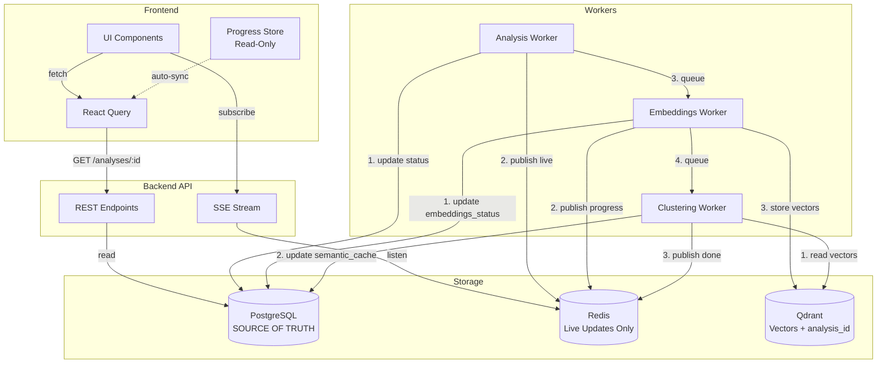

# Архитектурный анализ системы отслеживания прогресса

## 🔴 Выявленные проблемы

### 1. Множественные источники истины (Multiple Sources of Truth)

```
Redis (TTL 1h)          PostgreSQL (∞)       Qdrant (∞)           Frontend Zustand (session)
├─ analysis progress    ├─ Analysis table    ├─ Vectors           ├─ ProgressStore
├─ embedding progress   │  └─ semantic_cache │  ├─ repository_id  │  └─ tasks[]
└─ analysis_id          ├─ Commits table     │  ├─ commit_sha     ├─ CommitSelectionStore
                        │  └─ analysis_id    │  └─ NO analysis_id!│  └─ selectedAnalysisId
                        └─ status, vci_score                       └─ AnalysisDataStore
```

**Проблема**: Нет единого источника истины. Когда Redis TTL истекает, невозможно точно определить состояние системы.

### 2. Критическая проблема: analysis_id отсутствует в Qdrant

**Текущая структура вектора в Qdrant:**
```json
{
  "id": 123456789,
  "vector": [0.1, 0.2, ...],
  "payload": {
    "repository_id": "499bb544-...",
    "commit_sha": "16e04f9...",
    "file_path": "app/main.py",
    "language": "python",
    "chunk_type": "function",
    "name": "analyze_code",
    "content": "..."
    // ❌ analysis_id ОТСУТСТВУЕТ!
  }
}
```

**Последствия:**
- Когда Redis state истекает → backend не знает какому analysis принадлежат векторы
- Frontend получает vectors_stored: 772 но не знает это старые или новые данные
- Появляется ложный "completed" status для нового analysis

### 3. Race Conditions в frontend

**Цепочка событий при запуске нового analysis:**

```
T0: User clicks "Run Analysis"
    ├─ use-analysis-stream.startAnalysis()
    │  ├─ addTask('analysis-repo-id')
    │  ├─ setStatus('pending')
    │  └─ API POST /analyses → returns analysis_id
    │
T1: SSE connected → updates flowing
    ├─ updateTask('analysis-repo-id', {progress: 5, stage: 'initializing'})
    ├─ updateTask('analysis-repo-id', {progress: 15, stage: 'cloning'})
    └─ ...
    │
T2: Analysis completed
    ├─ updateTask('analysis-repo-id', {status: 'completed', progress: 100})
    ├─ addTask('embeddings-repo-id', {status: 'pending'})  // ⚠️ Добавляется СРАЗУ
    ├─ setSelectedCommit(commitSha, analysisId)            // ⚠️ Триггерит re-render
    └─ queryClient.invalidateQueries(['commits'])          // ⚠️ Refresh commits list
    │
T3: semantic-analysis-section.tsx polling запускается
    ├─ useEffect([selectedAnalysisId]) → triggers polling
    ├─ fetchStatus() → backend returns старый completed status из Redis/Qdrant
    │  └─ {status: 'completed', vectors: 772, analysis_id: 'OLD_ID'}  // ❌ Старые данные!
    ├─ Frontend видит completed → removeTask('embeddings-repo-id')    // ❌ Удаляет task!
    └─ Прогресс-бар закрывается
    │
T4: Celery worker РЕАЛЬНО начинает embeddings (через 5-10 секунд)
    ├─ publish_embedding_progress(status: 'running', vectors: 0)
    ├─ Frontend polling видит новый status
    ├─ addTask('embeddings-repo-id') СНОВА                            // ❌ Добавляет опять!
    └─ Прогресс-бар появляется СНОВА
```

### 4. Qdrant Fallback Logic (источник "ghost completed")

**Проблемный код в `semantic.py:1123-1143`:**
```python
if status == "running":
    redis_vectors = state.get("vectors_stored", 0)
    
    # ❌ ПРОБЛЕМА: Когда новый analysis только начался,
    # redis_vectors = 0, но Qdrant имеет 772 старых векторов
    if redis_vectors > 0 or redis_chunks > 0:  # Условие НЕ выполняется!
        # Проверка Qdrant пропускается
        pass
    # Возвращает running с vectors: 0
    
# НО! В другом месте кода:
if count.count >= redis_vectors:  # 772 >= 0 = TRUE! ❌
    return "completed"  # Ложный completed!
```

### 5. Semantic Cache Delay

**Последовательность:**
```
T0: Embeddings worker завершает генерацию векторов
    └─ publish_progress("completed", vectors: 1025)
    
T1: Worker вызывает _compute_and_store_semantic_cache()
    ├─ Fetching 1025 vectors from Qdrant (2-3 сек)
    ├─ HDBSCAN clustering (5-10 сек)
    ├─ Outlier analysis with imports (10-15 сек)
    └─ Store in PostgreSQL
    
T2: Frontend polling видит completed
    └─ fetchSemanticCache() → {is_cached: false}  // ❌ Ещё не готов!
    
T3-T10: Frontend продолжает polling и refresh (каждые 2 сек)
    └─ fetchSemanticCache() → {is_cached: false}  // Всё ещё нет
    
T11: Наконец is_cached: true появляется
```

## 🎯 Корневые причины

### Главная проблема #1: Отсутствие analysis_id в векторах
- **Симптом**: Backend не может определить какому analysis принадлежат векторы
- **Следствие**: Ложный "completed" status, confusion в frontend

### Главная проблема #2: Redis как ненадёжный источник истины
- **Симптом**: TTL истекает, state теряется, но система продолжает работать
- **Следствие**: Fallback логика пытается угадать состояние по косвенным данным

### Главная проблема #3: Embeddings task добавляется ДО начала работы
- **Симптом**: Task появляется в прогресс-баре сразу после analysis complete
- **Следствие**: Frontend видит старые данные и удаляет task преждевременно

### Главная проблема #4: Polling слишком агрессивный
- **Симптом**: 30+ одинаковых poll requests подряд, каждые 2 секунды
- **Следствие**: Лишняя нагрузка, race conditions, дёрганье UI

---

## 💡 Архитектурное решение

### Принцип: Single Source of Truth

**PostgreSQL Analysis.semantic_cache** должен быть ЕДИНСТВЕННЫМ источником истины для semantic analysis state.

```
┌─────────────────────────────────────────────────────────────┐
│ PostgreSQL Analysis Table (SINGLE SOURCE OF TRUTH)          │
├─────────────────────────────────────────────────────────────┤
│ - status: 'pending' | 'running' | 'completed' | 'failed'    │
│ - semantic_cache: JSONB | NULL                              │
│   ├─ architecture_health: {...}                             │
│   ├─ computed_at: timestamp                                 │
│   └─ vectors_count: 1025                                    │
│ - embeddings_status: 'none' | 'pending' | 'completed'       │
│ - embeddings_progress: 0-100                                │
│ - embeddings_message: string                                │
└─────────────────────────────────────────────────────────────┘
                              ▲
                              │ READ ONLY
                              │
┌─────────────────────────────────────────────────────────────┐
│ Backend API (читает PostgreSQL, возвращает истину)          │
└─────────────────────────────────────────────────────────────┘
                              ▲
                              │
┌─────────────────────────────────────────────────────────────┐
│ Frontend (простой consumer, верит backend)                  │
└─────────────────────────────────────────────────────────────┘
```

### Решение 1: Добавить analysis_id в Qdrant векторы

**Новая структура payload:**
```json
{
  "repository_id": "499bb544-...",
  "commit_sha": "16e04f9...",
  "analysis_id": "6aa4e309-...",  // ✅ ДОБАВИТЬ!
  "file_path": "app/main.py",
  "language": "python",
  "content": "..."
}
```

**Миграция:**
1. Добавить поле в embeddings worker
2. Запустить миграцию существующих векторов (найти analysis по repository_id + commit_sha)
3. Обновить API endpoints для использования analysis_id filter

### Решение 2: Хранить embeddings_status в PostgreSQL

**Новые поля в Analysis table:**
```sql
ALTER TABLE analyses ADD COLUMN embeddings_status VARCHAR(20) DEFAULT 'none';
ALTER TABLE analyses ADD COLUMN embeddings_progress INTEGER DEFAULT 0;
ALTER TABLE analyses ADD COLUMN embeddings_started_at TIMESTAMP;
ALTER TABLE analyses ADD COLUMN embeddings_completed_at TIMESTAMP;
```

**Преимущества:**
- Постоянное хранение (не теряется при restart)
- Можно query точный статус для любого analysis
- Redis используется только для live updates (optional)

### Решение 3: Упростить frontend state management

**Убрать дублирование:**

```typescript
// БЫЛО: 4 разных stores + polling + SSE
- useAnalysisProgressStore  // Global progress popup
- useCommitSelectionStore   // Selected commit/analysis
- useAnalysisDataStore      // Cached analysis data
- Local polling в semantic-analysis-section.tsx

// СТАЛО: 1 unified store + React Query
- useAnalysisStore (combines all)
  ├─ selectedAnalysis (commit + analysis data)
  ├─ embeddingsState (status from API)
  └─ progress (from SSE only)

- React Query для fetching
  ├─ автоматический refetch
  ├─ caching
  └─ deduplication
```

### Решение 4: Event-Driven Architecture

**Вместо polling → WebSocket/SSE events:**

```
Backend Events:
- analysis.started
- analysis.progress (5%, 15%, 25%, ...)
- analysis.completed
- embeddings.queued
- embeddings.started
- embeddings.progress (10%, 20%, ...)
- embeddings.indexing
- embeddings.completed
- semantic_cache.computing
- semantic_cache.ready

Frontend:
- Subscribe к events для current analysis
- Update UI только на events
- NO POLLING (кроме fallback для missed events)
```

### Решение 5: Разделить Celery tasks

**Текущая проблема:**
```python
# analyze_repository task:
1. Clone repo
2. Run analysis
3. Save results
4. Collect files
5. reset_embedding_state()      # ❌ Устанавливает pending СРАЗУ
6. generate_embeddings.delay()  # ❌ Но worker не начал работу!
```

**Решение:**
```python
# analyze_repository task:
1. Clone repo
2. Run analysis  
3. Save results
4. Return (НЕ трогаем embeddings!)

# generate_embeddings task:
0. ПРИ СТАРТЕ: Update PostgreSQL embeddings_status = 'running'
1. Generate vectors
2. Store in Qdrant
3. Compute semantic_cache
4. Update PostgreSQL embeddings_status = 'completed'
```

---

## 📋 План рефакторинга

### Фаза 1: Backend Foundation (2-3 дня)

1. **Миграция БД:**
   ```sql
   -- Новые поля для tracking embeddings в Analysis
   ALTER TABLE analyses ADD COLUMN embeddings_status VARCHAR(20) DEFAULT 'none';
   ALTER TABLE analyses ADD COLUMN embeddings_progress INTEGER DEFAULT 0;
   ALTER TABLE analyses ADD COLUMN embeddings_message TEXT;
   ALTER TABLE analyses ADD COLUMN embeddings_started_at TIMESTAMP;
   ALTER TABLE analyses ADD COLUMN embeddings_completed_at TIMESTAMP;
   ALTER TABLE analyses ADD COLUMN embeddings_vectors_count INTEGER DEFAULT 0;
   ```

2. **Qdrant migration script:**
   - Обновить все существующие векторы: добавить analysis_id
   - Скрипт должен найти analysis по repository_id + commit_sha

3. **Обновить embeddings worker:**
   - При старте: UPDATE Analysis SET embeddings_status='running', embeddings_started_at=NOW()
   - При прогрессе: UPDATE embeddings_progress, embeddings_message
   - При завершении: UPDATE embeddings_status='completed', embeddings_completed_at=NOW(), embeddings_vectors_count=X
   - Добавлять analysis_id в каждый вектор в Qdrant

4. **Упростить endpoint embedding-status:**
   ```python
   @router.get("/analyses/{analysis_id}/embeddings-status")
   async def get_embeddings_status(analysis_id: UUID):
       # 1. Fetch Analysis from PostgreSQL
       # 2. Return embeddings_status, embeddings_progress, embeddings_message
       # 3. Если status='completed' && semantic_cache IS NULL → status='computing_cache'
       # 4. NO Redis fallback, NO Qdrant fallback
       # 5. Простая логика: PostgreSQL = source of truth
   ```

### Фаза 2: Frontend Refactoring (2-3 дня)

1. **Убрать polling из semantic-analysis-section.tsx:**
   - Использовать React Query с автоматическим refetch
   - Interval только когда status = 'running' или 'computing_cache'

2. **Упростить progress store:**
   ```typescript
   // Убрать manual addTask/removeTask
   // Автоматически sync с API данными
   
   const { data: analysisProgress } = useQuery({
     queryKey: ['analysis', analysisId, 'progress'],
     queryFn: () => api.getAnalysisProgress(analysisId),
     refetchInterval: (data) => 
       data?.status === 'running' ? 2000 : false,
   })
   ```

3. **Убрать race condition в commit-timeline:**
   - useEffect не должен трогать selectedAnalysisId
   - Только use-analysis-stream устанавливает после completion

### Фаза 3: Улучшение UX (1 день)

1. **Честный прогресс-бар:**
   - Показывать реальные этапы: Analysis → Embeddings → Clustering
   - Не скрывать task пока ВСЁ не завершено (включая semantic_cache)

2. **Индикатор "Computing semantic analysis":**
   - Когда vectors готовы но semantic_cache = NULL
   - Показывать spinner с сообщением "Analyzing architecture..."

3. **Debounce UI updates:**
   - Не re-render на каждое изменение
   - Batch updates с requestAnimationFrame

---

## 🔄 Новая архитектура (предложение)



### Ключевые принципы:

1. **PostgreSQL = Single Source of Truth**
   - Все состояния хранятся в БД
   - Redis только для live updates (необязательно)

2. **Workers независимы**
   - Analysis → завершается, очередь embeddings
   - Embeddings → запускается, сам управляет своим state
   - Clustering → запускается после embeddings

3. **Frontend простой**
   - React Query для fetching (с auto-refetch)
   - SSE для live updates (опционально)
   - NO manual polling, NO state guessing

4. **Qdrant содержит analysis_id**
   - Можно точно определить какому analysis принадлежат векторы
   - Можно удалять векторы конкретного analysis
   - Можно иметь несколько analysis параллельно

---

## 🚀 Быстрые wins (можно сделать сразу)

### Quick Fix #1: Не добавлять embeddings task преждевременно

**В `use-analysis-stream.ts:302`:**
```typescript
// УБРАТЬ это:
addTask({
  id: embeddingsTaskId,
  type: 'embeddings',
  status: 'pending',  // ❌ Добавляется ДО начала работы!
})

// ВМЕСТО: пусть semantic-analysis-section добавляет
// когда РЕАЛЬНО видит status='running' от backend
```

### Quick Fix #2: Endpoint должен возвращать NULL когда не знает

**В `semantic.py`:**
```python
# Если Redis пустой И semantic_cache = NULL:
return {
    "status": "unknown",  # Честно признаём что не знаем
    "analysis_id": None,
}

# Frontend увидит unknown → не делает ничего, ждёт
```

### Quick Fix #3: Остановить polling когда semantic_cache готов

```typescript
// В semantic-analysis-section.tsx:
const shouldStopPolling = 
    semanticCache?.is_cached === true  // ✅ Cache готов
    && !hasTask(taskId)                // ✅ Нет активных tasks
    
// Текущая проблема: polling продолжается даже когда is_cached=true
```

---

## 📊 Метрики для отслеживания

После рефакторинга измерить:

1. **Time to semantic_cache ready**
   - Сейчас: 20-40 секунд после embeddings complete
   - Цель: <15 секунд

2. **False "completed" events**
   - Сейчас: 1-2 на каждый analysis
   - Цель: 0

3. **Polling requests**
   - Сейчас: 30-50 за время embeddings
   - Цель: <10 (с увеличенным interval)

4. **UI updates per second**
   - Сейчас: 5-10 renders/sec
   - Цель: <2 renders/sec (debounced)

---

## ⚠️ Риски и ограничения

### Риск #1: Миграция Qdrant
- Нужно обновить все существующие векторы
- Может занять время на больших репозиториях
- Нужен rollback план

### Риск #2: Breaking changes
- API изменения требуют обновления frontend
- Нужна backwards compatibility или координированный deploy

### Риск #3: Производительность PostgreSQL
- Более частые UPDATE запросы к Analysis table
- Нужны индексы на embeddings_status

---

## 🎬 Следующие шаги

1. **Review этого документа с командой**
2. **Выбрать подход: полный рефакторинг или quick fixes**
3. **Создать detailed implementation plan**
4. **Написать migration scripts**
5. **Implement по фазам с тестированием**