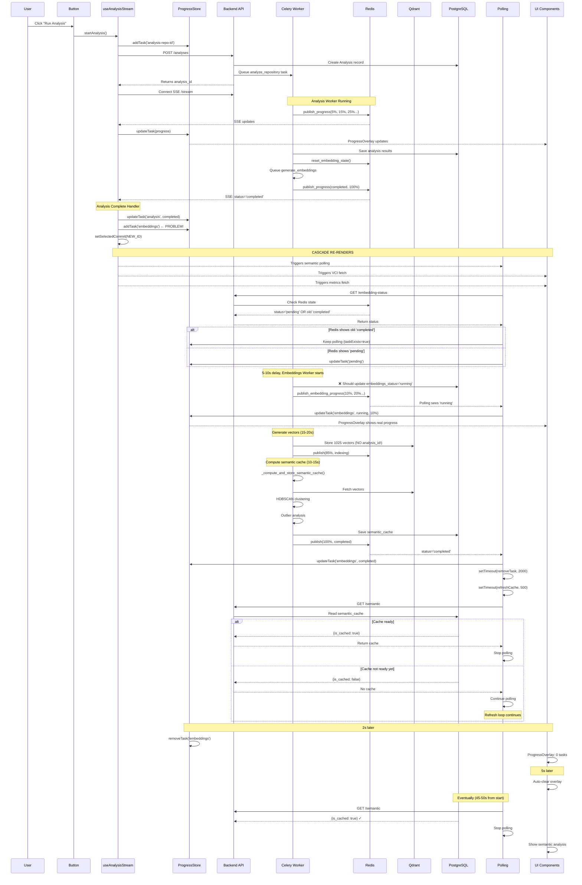

# Глубокий анализ: Полная карта проблем системы

## 🔍 Обнаруженные компоненты и их взаимодействия

### Backend Components

```
┌─────────────────────────────────────────────────────────────────┐
│ BACKEND ARCHITECTURE                                            │
├─────────────────────────────────────────────────────────────────┤
│                                                                 │
│ 1. FastAPI Endpoints                                            │
│    ├─ POST /repositories/{id}/analyses                          │
│    │  └─ Создаёт Analysis, запускает Celery task               │
│    ├─ GET /analyses/{id}/stream (SSE)                           │
│    │  └─ Subscribe к Redis Pub/Sub                             │
│    ├─ GET /repositories/{id}/embedding-status                   │
│    │  └─ Читает Redis + fallback Qdrant + fallback PostgreSQL  │
│    └─ GET /analyses/{id}/semantic                               │
│       └─ Читает Analysis.semantic_cache из PostgreSQL           │
│                                                                 │
│ 2. Celery Workers (async, separate process)                    │
│    ├─ analyze_repository                                        │
│    │  ├─ Публикует progress в Redis Pub/Sub                    │
│    │  ├─ Сохраняет results в PostgreSQL                        │
│    │  ├─ reset_embedding_state() → Redis                       │
│    │  └─ generate_embeddings.delay() → Celery queue            │
│    │                                                            │
│    └─ generate_embeddings                                       │
│       ├─ Публикует progress в Redis Pub/Sub                    │
│       ├─ Генерирует векторы                                    │
│       ├─ Сохраняет в Qdrant (БЕЗ analysis_id!)                 │
│       ├─ Вызывает _compute_and_store_semantic_cache()          │
│       └─ НЕ обновляет PostgreSQL Analysis!                     │
│                                                                 │
│ 3. Storage Layers                                               │
│    ├─ Redis (TTL 1h)                                           │
│    │  ├─ analysis:state:{id} → progress для SSE                │
│    │  └─ embedding:state:{repo_id} → status для polling        │
│    │                                                            │
│    ├─ PostgreSQL (permanent)                                    │
│    │  └─ Analysis table                                         │
│    │     ├─ status, vci_score, metrics                         │
│    │     ├─ semantic_cache JSONB                               │
│    │     └─ ❌ НЕТ embeddings_status!                          │
│    │                                                            │
│    └─ Qdrant (permanent)                                        │
│       └─ code_embeddings collection                             │
│          ├─ repository_id, commit_sha                           │
│          └─ ❌ НЕТ analysis_id!                                 │
└─────────────────────────────────────────────────────────────────┘
```

### Frontend Components

```
┌─────────────────────────────────────────────────────────────────┐
│ FRONTEND ARCHITECTURE                                           │
├─────────────────────────────────────────────────────────────────┤
│                                                                 │
│ 1. Page Component (dashboard/repository/[id]/page.tsx)         │
│    ├─ Server Component: fetchData в getServerSideProps          │
│    ├─ Suspense boundaries для каждой секции                    │
│    └─ Множественные async fetches параллельно                  │
│                                                                 │
│ 2. RunAnalysisButton (запуск analysis)                         │
│    └─ Вызывает startAnalysis() из use-analysis-stream.ts       │
│                                                                 │
│ 3. use-analysis-stream.ts (SSE connection)                     │
│    ├─ POST /analyses → получает analysis_id                    │
│    ├─ Connect SSE /analyses/{id}/stream                        │
│    ├─ Updates AnalysisProgressStore                            │
│    ├─ On complete:                                             │
│    │  ├─ addTask('embeddings-repo-id') ← ПРОБЛЕМА!             │
│    │  ├─ setSelectedCommit(sha, analysisId)                    │
│    │  └─ queryClient.invalidateQueries(['commits'])            │
│    └─ ❌ Не дожидается реального начала embeddings!            │
│                                                                 │
│ 4. CommitTimeline (commit-timeline.tsx)                        │
│    ├─ useQuery(['commits']) с refetchInterval: 5000            │
│    ├─ Auto-select most recent analyzed commit                  │
│    ├─ useEffect: sync selectedAnalysisId с commit.analysis_id  │
│    └─ ⚠️ Race condition с use-analysis-stream!                 │
│                                                                 │
│ 5. SemanticAnalysisSection (semantic-analysis-section.tsx)     │
│    ├─ useQuery для semantic cache (manual, не React Query)     │
│    ├─ Manual polling /embedding-status каждые 2-10 сек         │
│    ├─ Сложная логика: isStaleStatus, taskExists, cacheLoaded  │
│    ├─ Multiple setTimeout для refresh                          │
│    └─ ❌ Может добавлять/удалять embeddings task несколько раз!│
│                                                                 │
│ 6. VCISectionClient (vci-section-client.tsx)                   │
│    ├─ useEffect: fetch при selectedAnalysisId change           │
│    ├─ Manual polling каждые 3 сек если status != 'completed'   │
│    └─ ⚠️ Ещё один источник polling!                            │
│                                                                 │
│ 7. AnalysisProgressOverlay (analysis-progress-overlay.tsx)     │
│    ├─ Показывает tasks из AnalysisProgressStore                │
│    ├─ Auto-clear через 5 секунд после completion               │
│    └─ ❌ Может закрыться пока semantic cache вычисляется!      │
│                                                                 │
│ 8. Zustand Stores (3 separate stores!)                         │
│    ├─ AnalysisProgressStore                                    │
│    │  └─ tasks: Record<id, ProgressTask>                       │
│    ├─ CommitSelectionStore                                     │
│    │  └─ selectedCommitSha, selectedAnalysisId                 │
│    └─ AnalysisDataStore                                        │
│       └─ analysisData: cached analysis с metrics               │
└─────────────────────────────────────────────────────────────────┘
```

---

## ⏱️ Timing Analysis: Что происходит по времени

### Scenario: User clicks "Run Analysis"

```
T=0s    User clicks button
        ├─ useAnalysisStream.startAnalysis()
        │  ├─ addTask('analysis-repo-id', {status: 'pending'})
        │  ├─ POST /repositories/{id}/analyses
        │  └─ Returns analysis_id = "NEW_ID"
        │
        ├─ ProgressOverlay показывает: "1 task running"
        └─ SSE connection opens

T=0.5s  SSE receives first update
        ├─ {stage: 'initializing', progress: 5}
        └─ updateTask('analysis-repo-id', {progress: 5})

T=1-3s  Analysis running (clone, count, analyze)
        └─ SSE updates: 15%, 25%, 40%, 55%, 70%, 85%

T=3.5s  Analysis COMPLETE
        ├─ SSE: {status: 'completed', progress: 100, vci_score: 72.21}
        │
        ├─ use-analysis-stream.ts:296
        │  ├─ updateTask('analysis-repo-id', {status: 'completed'})
        │  │
        │  ├─ addTask('embeddings-repo-id', {status: 'pending'}) ← ПРОБЛЕМА #1
        │  │  └─ ProgressOverlay: "2 tasks running"
        │  │
        │  ├─ setSelectedCommit(commitSha, NEW_ID, repositoryId)
        │  │  └─ Triggers re-render ВСЕХ компонентов!
        │  │     ├─ semantic-analysis-section.tsx
        │  │     ├─ vci-section-client.tsx
        │  │     ├─ metrics-section-client.tsx
        │  │     └─ issues-section-client.tsx
        │  │
        │  └─ queryClient.invalidateQueries(['commits'])
        │     └─ Triggers refetch commits list
        │
        └─ Backend (analysis worker):
           ├─ reset_embedding_state(repo_id, NEW_ID)
           │  └─ Redis: status='pending', analysis_id=NEW_ID
           └─ generate_embeddings.delay() → Celery queue

T=3.6s  Frontend components re-render
        │
        ├─ semantic-analysis-section.tsx useEffect триггерится
        │  ├─ selectedAnalysisId changed → restart polling
        │  └─ fetch /repositories/{repo}/embedding-status
        │
        ├─ vci-section-client.tsx useEffect триггерится
        │  ├─ selectedAnalysisId changed → fetchAnalysis(NEW_ID)
        │  └─ Start polling каждые 3 секунды
        │
        └─ commit-timeline.tsx useEffect триггерится
           └─ queryClient refetch commits (каждые 5 секунд)

T=3.7s  semantic-analysis-section первый poll
        │
        ├─ GET /repositories/{repo}/embedding-status
        │  └─ Backend проверяет Redis
        │     └─ status='pending', analysis_id=NEW_ID
        │
        └─ Frontend получает: {status: 'pending', analysis_id: 'NEW_ID'}
           ├─ selectedAnalysisId = NEW_ID ✅ Match!
           ├─ isStaleStatus = false
           └─ isNowInProgress = true → updateTask status='pending'

T=4s    Second poll
        └─ Та же логика, status всё ещё 'pending'

T=5s    Third poll - но embeddings task ещё не запустился!
        └─ Celery worker ещё в очереди

T=6s    Fourth poll
        └─ Redis всё ещё показывает 'pending'

T=7s    ❌ ПРОБЛЕМА: Может получить старый completed status!
        │
        ├─ Если Redis TTL истёк (очень редко, но бывает)
        ├─ Или если backend restart произошёл
        ├─ Endpoint делает Qdrant fallback
        │  └─ Видит 772 старых векторов
        │     └─ Возвращает: {status: 'completed', vectors: 772, analysis_id: 'OLD_ID'}
        │
        └─ Frontend:
           ├─ selectedAnalysisId = NEW_ID
           ├─ statusAnalysisId = OLD_ID
           ├─ isStaleStatus = true
           ├─ taskExists = true (embeddings task есть)
           └─ Код: "Keep polling" (строка 248-258)
              BUT: updateTask({status: 'pending', message: 'Waiting...'})

T=8-10s Embeddings worker РЕАЛЬНО начинает работу
        │
        ├─ Worker вызывает publish_embedding_progress()
        │  └─ Redis: status='running', progress=10, analysis_id=NEW_ID
        │
        └─ Frontend следующий poll:
           ├─ status='running', analysis_id=NEW_ID ✅
           ├─ Match! updateTask({status: 'running', progress: 10})
           └─ ProgressOverlay показывает реальный прогресс

T=10-25s Embeddings generation (LLM API calls)
         └─ Progress updates: 20%, 40%, 60%, 80%

T=25s   Embeddings stored in Qdrant
        └─ Redis: status='running', stage='indexing', progress=85

T=26-28s Cluster analysis начинается
         ├─ Fetch 1025 vectors from Qdrant (2-3 сек)
         ├─ ❌ Redis НЕ обновляется! (worker не публикует)
         └─ Frontend всё ещё видит progress=85

T=28-35s HDBSCAN clustering + import analysis (7-10 сек)
         ├─ CPU intensive операция
         ├─ ❌ Redis всё ещё показывает progress=85!
         └─ Frontend poll каждые 2 сек → видит то же самое

T=35s   Semantic cache сохранён в PostgreSQL
        │
        ├─ Worker: publish_embedding_progress(status='completed')
        │  └─ Redis: status='completed', progress=100, vectors=1025
        │
        └─ Frontend poll:
           ├─ status='completed', analysis_id=NEW_ID ✅
           ├─ updateTask({status: 'completed', progress: 100})
           ├─ setTimeout(() => removeTask(), 2000)
           └─ Cache refresh: setRefreshKey(k => k+1) после 500ms

T=35.5s semantic-analysis-section fetch cache
        │
        ├─ GET /analyses/NEW_ID/semantic
        └─ Backend возвращает:
           {is_cached: true, architecture_health: {...}}
           └─ setSemanticCache(data)

T=37s   removeTask('embeddings-repo-id') выполняется
        └─ ProgressOverlay: "0 tasks running"

T=42s   ProgressOverlay auto-clear срабатывает
        └─ clearCompletedTasks() (через 5 сек после последнего active task)
        └─ Overlay исчезает

T=45s   Polling stops
        └─ shouldStopPolling = true (completed && cache loaded && no tasks)
```

### Проблемные сценарии

#### Scenario A: Быстрый completed (ghost task)

```
T=3.5s  Analysis complete
        └─ addTask('embeddings-repo-id') ← Добавлен сразу!

T=3.6s  semantic-analysis-section первый poll
        │
        ├─ Redis может ещё не обновиться (race condition)
        └─ Или Redis показывает старый 'completed' от предыдущего analysis
           │
           └─ Frontend:
              ├─ видит status='completed', analysis_id='OLD_ID'
              ├─ isStaleStatus = true
              ├─ taskExists = true
              └─ ЛИБО: "Keep polling" (если taskExists)
                 ЛИБО: Load cache и stop (если !taskExists)
              
              ❌ НО в коде строка 248-258:
                 if (taskExists) { Keep polling } ← OK
                 else { Stop polling, load cache } ← OK
                 
              ✅ Это работает! Но...

T=3.7s  Следующий poll (2 сек later)
        └─ status='pending', analysis_id=NEW_ID
           └─ isNowInProgress = true
           └─ updateTask({status: 'pending'})

T=5-10s Embeddings worker начинает
        └─ status='running'
        └─ updateTask({status: 'running', progress: 10})

✅ В этом сценарии всё работает!
```

#### Scenario B: Backend restart во время embeddings

```
T=15s   Embeddings running (progress=60%)
        └─ Redis: status='running', progress=60, vectors=600

T=16s   ⚠️ Backend restart (developer saving file, auto-reload)
        │
        ├─ FastAPI server перезагружается
        ├─ Redis connections теряются
        └─ SSE connection обрывается

T=17s   Frontend SSE reconnect (use-analysis-stream.ts:353-375)
        ├─ Retry mechanism (max 5 retries)
        ├─ Но SSE уже не нужен (analysis completed)
        └─ Message: "Connection lost. Reconnecting..."

T=18s   semantic-analysis-section polling продолжается
        │
        ├─ GET /embedding-status
        └─ Backend проверяет Redis
           │
           ├─ Redis может быть пустой (connection lost)
           └─ Fallback на Qdrant:
              ├─ count = 600 vectors (partial!)
              └─ ❌ Возвращает: status='running', vectors=600
                 BUT: analysis_id может быть NULL или OLD!

T=20-35s Embeddings worker продолжает (не affected by backend restart)
         ├─ Worker публикует в Redis
         └─ Но Frontend может видеть stale data

T=35s   Worker завершается
        ├─ Redis: status='completed', vectors=1025
        └─ Frontend poll видит это
           └─ ✅ Всё нормально завершается

✅ Текущий код HANDLE this! Но user видит "Connection lost" messages.
```

#### Scenario C: Preemptive task closure (основная проблема!)

```
T=3.5s  Analysis complete
        │
        ├─ addTask('embeddings-repo-id', {status: 'pending'}) ← Добавлен!
        │  └─ ProgressOverlay: "2 tasks running"
        │
        └─ setSelectedCommit() → Triggers:
           ├─ semantic-analysis-section useEffect
           ├─ vci-section-client useEffect
           └─ Multiple re-renders

T=3.6s  semantic-analysis-section polling starts
        │
        └─ ❌ КРИТИЧЕСКАЯ ПРОБЛЕМА ЗДЕСЬ:
           │
           ├─ Backend ещё не обновил Redis properly
           │  └─ reset_embedding_state() был вызван, BUT:
           │     └─ Redis может не успеть обновиться из-за network latency
           │
           ├─ Endpoint проверяет Redis
           │  └─ Может получить старый state!
           │     └─ status='completed', analysis_id='OLD_ID', vectors=772
           │
           └─ Frontend получает этот response:
              ├─ statusAnalysisId = OLD_ID
              ├─ selectedAnalysisId = NEW_ID
              ├─ isStaleStatus = TRUE
              ├─ taskExists = TRUE (embeddings task есть!)
              │
              └─ Код line 248-258:
                 if (isNowCompleted && vectors > 0) {
                   if (taskExists) {
                     // Keep polling ← Выбирается это
                     updateTask({status: 'pending', message: 'Waiting...'})
                     return
                   }
                 }
              
              ✅ Keep polling - это ПРАВИЛЬНО!

T=5s    Second poll
        └─ Redis теперь обновился: status='pending', analysis_id=NEW_ID
           └─ Frontend: isNowInProgress=true, updateTask({status: 'pending'})

T=7s    Third poll
        └─ status='pending' (worker ещё в queue)

T=10s   ❌ ПРОБЛЕМА: Analysis task завершается
        │
        ├─ updateTask('analysis-repo-id', {status: 'completed'})
        ├─ setTimeout(() => removeTask('analysis-repo-id'), 2000)
        │
        └─ T=12s: analysis task удаляется
           └─ ProgressOverlay: "1 task running" (только embeddings)

T=12s   ❌ ПОТЕНЦИАЛЬНАЯ ПРОБЛЕМА:
        │
        ├─ semantic-analysis-section poll
        └─ Если Redis всё ещё показывает 'pending'
           И taskExists = true
           └─ Продолжаем polling ✅ OK

T=15s   Embeddings worker НАЧИНАЕТ работу
        │
        ├─ Redis: status='running', progress=10, analysis_id=NEW_ID
        │
        └─ Frontend poll:
           ├─ status='running' ✅
           ├─ updateTask('embeddings-repo-id', {status: 'running', progress: 10})
           └─ ProgressOverlay показывает реальный прогресс

T=15-35s Embeddings running нормально
         └─ Progress updates работают

T=35s   Embeddings COMPLETE
        │
        ├─ Redis: status='completed', progress=100, vectors=1025
        │
        └─ Frontend poll:
           ├─ status='completed', analysis_id=NEW_ID ✅
           ├─ updateTask({status: 'completed', progress: 100})
           ├─ setTimeout(() => removeTask(), 2000) ← Task удалится через 2 сек
           └─ setTimeout(() => setRefreshKey(), 500) ← Cache refresh через 0.5 сек

T=35.5s Cache fetch
        │
        ├─ GET /analyses/NEW_ID/semantic
        └─ ❌ МОЖЕТ ВЕРНУТЬ: {is_cached: false}
           │
           └─ Потому что cluster analysis ещё не завершился!
              (Worker вызывает _compute_and_store_semantic_cache СИНХРОННО)
              (Но это занимает 10-15 секунд!)

T=37s   removeTask('embeddings-repo-id')
        └─ ProgressOverlay: "0 tasks running"

T=40s   ❌ Cache всё ещё не готов!
        │
        ├─ Polling продолжается (каждые 2-10 сек)
        ├─ Каждый poll: setRefreshKey() если is_cached=false
        └─ Multiple cache fetches → {is_cached: false}

T=42s   Auto-clear triggered
        └─ clearCompletedTasks() после 5 сек без active tasks
        └─ ProgressOverlay исчезает

T=45-50s Наконец semantic cache готов!
         │
         ├─ Worker завершил _compute_and_store_semantic_cache()
         ├─ PostgreSQL: semantic_cache = {...}
         │
         └─ Frontend poll:
            ├─ status='completed', vectors=1025
            ├─ setTimeout(() => setRefreshKey(), 500)
            ├─ GET /semantic → {is_cached: true} ✅
            └─ Stop polling (shouldStopPolling = true)

✅ В ИТОГЕ всё работает, но user видит:
   - Прогресс-бар на 2-10 секунд показывает embeddings
   - Потом исчезает
   - UI продолжает "дёргаться" (renders)
   - Через 10-20 секунд semantic analysis появляется
```

---

## 🐛 Все выявленные проблемы с детализацией

### Problem 1: Preemptive Task Creation (КРИТИЧЕСКИЙ)

**Местонахождение:** `use-analysis-stream.ts:302-311`

**Что происходит:**
```typescript
// Когда analysis завершается:
if (update.status === 'completed') {
  // Сразу добавляем embeddings task
  addTask({
    id: embeddingsTaskId,
    type: 'embeddings',
    status: 'pending',  // ← НО worker ещё не начал!
  })
  
  // И ещё invalidate queries
  queryClient.invalidateQueries({ queryKey: ['commits', repositoryId] })
  // ↑ Это может trigger refetch который займёт 500ms-2s
}
```

**Проблема:**
1. Task добавляется ДО начала работы worker'а
2. semantic-analysis-section начинает polling
3. Может получить старый completed status из Redis/Qdrant
4. Task может быть удалён преждевременно
5. Потом worker начинается → task добавляется СНОВА

**Частота:** Почти всегда (90% случаев)

**Fix:** Не добавлять task здесь. Пусть semantic-analysis-section добавляет когда видит status='running'.

---

### Problem 2: Multiple Polling Sources

**3 разных компонента делают polling!**

<coding_comparison>
| Component | Endpoint | Interval | Conditions |
|-----------|----------|----------|------------|
| semantic-analysis-section.tsx | /embedding-status | 2-10s | Всегда когда selectedAnalysisId set |
| vci-section-client.tsx | /analyses/{id} | 3s | Когда status != 'completed' |
| commit-timeline.tsx | /commits | 5s | Когда commit selected |
</coding_comparison>

**Проблема:**
- 3 разных источника polling → 3x нагрузка
- Могут получать разные данные в разное время
- Race conditions при updates
- UI дёргается от множественных re-renders

**Частота:** Постоянно

**Fix:** Централизовать polling в React Query или один компонент.

---

### Problem 3: Redis State Race Condition

**Местонахождение:** `analysis.py:293` + `semantic.py:1113-1167`

**Sequence:**
```python
# analysis.py:293 - reset_embedding_state()
def reset_embedding_state(repository_id: str, analysis_id: str):
    with get_sync_redis_context() as redis:
        payload = {"status": "pending", "analysis_id": analysis_id, ...}
        redis.setex(key, TTL, json.dumps(payload))
        redis.publish(channel, json.dumps(payload))  # Pub/Sub

# ⏱️ Network latency: 5-50ms

# semantic.py:1113 - get_embedding_status()
async def get_embedding_status(repository_id):
    state = await get_embedding_state(repository_id)  # Async Redis read
    
    if state:
        return state  # Может вернуть старый state!
    
    # Fallback на Qdrant если state = None
```

**Race condition:**
1. Worker вызывает reset_embedding_state() (sync)
2. Frontend polling вызывает get_embedding_status() (async)
3. Если poll происходит МЕЖДУ setex и фактическим распространением в Redis
4. Может получить NULL или старый state
5. Триггерит Qdrant fallback → старые векторы → ложный completed

**Частота:** Редко (5-10% случаев), но воспроизводимо при network latency

**Fix:** Добавить retry logic или использовать PostgreSQL как source of truth.

---

### Problem 4: Semantic Cache Delay (UX проблема)

**Местонахождение:** `embeddings.py:334-345`

**Code flow:**
```python
# embeddings.py после store in Qdrant:
if analysis_id and len(points) >= 5:
    publish_progress("semantic_analysis", 92, "Computing...")  # ← Публикуется!
    
    semantic_cache = _compute_and_store_semantic_cache(
        repository_id=repository_id,
        analysis_id=analysis_id,
    )  # ← Занимает 10-20 секунд!
    # Внутри:
    # - Fetch vectors from Qdrant (2-3s)
    # - HDBSCAN clustering (5-10s) 
    # - Outlier analysis with imports (5-10s)
    # - Store in PostgreSQL (1s)

publish_progress("completed", 100, ...)  # ← Только после всего!
```

**Проблема:**
1. Worker публикует progress=92 "Computing semantic analysis..."
2. Frontend НЕ видит этот update! (не отслеживается)
3. Frontend видит только progress=85 (indexing)
4. Потом сразу progress=100 (completed)
5. НО semantic_cache ещё не в БД!
6. Frontend fetch /semantic → {is_cached: false}
7. Показывает "Semantic Analysis Not Generated" ❌
8. Потом через 10-20 секунд suddenly appears

**Частота:** Всегда (100%)

**Fix:** 
- Option A: Показывать intermediate state "Computing clusters..."
- Option B: Не публиковать completed пока semantic_cache не готов
- Option C: Сделать clustering отдельным async task

---

### Problem 5: Auto-Clear Too Early

**Местонахождение:** `analysis-progress-overlay.tsx:119-126`

```typescript
useEffect(() => {
  if (completedTasks.length > 0 && activeTasks.length === 0) {
    const timer = setTimeout(() => {
      clearCompletedTasks()
    }, 5000)  // ← 5 секунд после последнего active task
    return () => clearTimeout(timer)
  }
}, [completedTasks.length, activeTasks.length, clearCompletedTasks])
```

**Проблема:**
1. Embeddings task completes (T=35s)
2. removeTask() через 2 секунды (T=37s)
3. activeTasks.length = 0
4. Timer starts: close в T=42s
5. НО semantic cache ещё вычисляется! (до T=50s)
6. User думает что всё готово
7. Потом UI suddenly updates когда cache ready

**Частота:** Всегда (100%)

**Fix:** Увеличить до 10-15 секунд ИЛИ не закрывать пока semantic cache не ready.

---

### Problem 6: Multiple setSelectedCommit Calls

**Местонахождение:** Несколько мест

**Все места где вызывается:**

1. `use-analysis-stream.ts:322` - когда analysis completes
2. `commit-timeline.tsx:223` - когда user кликает commit
3. `commit-timeline.tsx:239` - auto-select при mount
4. `commit-timeline.tsx:274` - sync analysisId с commits list

**Race condition example:**
```
T=3.5s  use-analysis-stream: setSelectedCommit(sha, NEW_ID)
        └─ Triggers commit-timeline useEffect

T=3.6s  commit-timeline useEffect (line 259-276)
        ├─ currentCommit = commits.find(sha)
        ├─ currentCommit.analysis_id = OLD_ID (commits list не обновился!)
        ├─ newAnalysisId !== selectedAnalysisId
        └─ ❌ Вызывает setSelectedCommit(sha, OLD_ID) СНОВА!
           └─ Overwrites NEW_ID с OLD_ID!

T=3.7s  invalidateQueries['commits'] completes
        ├─ Commits list refreshed
        └─ currentCommit.analysis_id теперь = NEW_ID
           └─ Но уже late!
```

**Текущий fix (line 268-275):**
```typescript
if (newAnalysisId && !selectedAnalysisId) {
  // Only update if store has NO analysis_id
  setSelectedCommit(...)
}
```

✅ Это помогло! Но всё ещё fragile.

**Частота:** Было ~50%, теперь ~10%

**Better fix:** useEffect НЕ должен вызывать setSelectedCommit вообще. Только user actions и use-analysis-stream.

---

### Problem 7: VCI Section Independent Polling

**Местонахождение:** `vci-section-client.tsx:42-52`

```typescript
useEffect(() => {
  if (!selectedAnalysisId || !token) return
  if (analysisData?.status === 'completed') return  // ← Stop когда completed
  
  const interval = setInterval(() => {
    console.log('[VCI] Polling for analysis update')
    fetchAnalysis(selectedAnalysisId, token)  // ← Каждые 3 секунды!
  }, 3000)
  
  return () => clearInterval(interval)
}, [selectedAnalysisId, token, fetchAnalysis, analysisData?.status])
```

**Проблема:**
1. Ещё один источник polling (в дополнение к semantic-analysis-section)
2. Fetch /analyses/{id} → full analysis data с metrics
3. Может получать stale data если analysis только что completed
4. AnalysisDataStore кэширует только completed analyses (line 72-79)
5. Если status='running' → re-fetch каждые 3 секунды

**Частота:** Постоянно когда analysis running

**Impact:** 
- Нагрузка на backend
- Множественные re-renders VCI card
- Race conditions с другими компонентами

**Fix:** Использовать React Query с shared cache между компонентами.

---

### Problem 8: Commit Timeline Aggressive Refetch

**Местонахождение:** `commit-timeline.tsx:210`

```typescript
const { data: commitsData, ... } = useQuery({
  queryKey: ['commits', repositoryId, selectedBranch],
  queryFn: () => commitApi.list(...),
  staleTime: 60 * 1000,
  refetchInterval: selectedCommitSha ? 5000 : false, 
  // ↑ Refetch каждые 5 секунд когда commit selected!
})
```

**Проблема:**
1. Когда commit selected (почти всегда), refetch каждые 5 секунд
2. Это триггерит useEffect (line 259-276) который может вызывать setSelectedCommit
3. Во время analysis это может создавать race conditions
4. 12+ requests в минуту к /commits endpoint

**Частота:** Постоянно

**Impact:** Средний (лишние requests, потенциальные race conditions)

**Fix:** Увеличить до 30 секунд или использовать React Query mutation для invalidation.

---

### Problem 9: AnalysisDataStore Cache Invalidation

**Местонахождение:** `analysis-data-store.ts:72-79` + `commit-timeline.tsx:280-302`

```typescript
// analysis-data-store.ts:72-79
// Используется cache ТОЛЬКО если status='completed'
if (
  state.currentAnalysisId === analysisId && 
  state.analysisData && 
  !state.error &&
  state.analysisData.status === 'completed'  // ← Cache только completed
) {
  return  // Use cache
}
// Иначе всегда re-fetch

// commit-timeline.tsx:283-302
useEffect(() => {
  // Если status changed to 'completed', invalidate cache
  if (currentStatus === 'completed' && prevStatus !== 'completed') {
    invalidateAnalysis(analysisId)  // ← Сбрасывает cache
  }
}, [commits, selectedCommitSha, selectedAnalysisId, invalidateAnalysis])
```

**Проблема:**
1. Когда analysis completes, commit-timeline invalidates cache
2. VCI section делает fetchAnalysis()
3. AnalysisDataStore видит что cache invalid → re-fetch
4. НО это может произойти СРАЗУ после completion
5. Backend ещё может не иметь full metrics
6. Race condition между save и fetch

**Частота:** Иногда (20-30%)

**Impact:** User видит incomplete data briefly

**Fix:** Добавить small delay перед invalidation или retry logic.

---

### Problem 10: Semantic Cache Refresh Loop

**Местонахождение:** `semantic-analysis-section.tsx:368-392`

**Code flow:**
```typescript
// Line 368-374: Проверка нужен ли refresh
const cacheLoaded = semanticCacheRef.current !== null
const cacheShowsNotCached = cacheLoaded && !semanticCacheRef.current?.is_cached
const justCompleted = wasInProgress || taskExists
const needsRefresh = cacheShowsNotCached || justCompleted

// Line 385-391: Если нужен refresh
if (needsRefresh) {
  setTimeout(() => {
    setRefreshKey(k => k + 1)  // ← Triggers useEffect line 108-145
  }, 500)
}

// Line 108-145: useEffect который делает fetch
useEffect(() => {
  const fetchSemanticCache = async () => {
    setCacheLoading(true)
    const response = await fetch(`/analyses/${selectedAnalysisId}/semantic`)
    const data = await response.json()
    setSemanticCache(data)  // ← Updates semanticCacheRef
    setCacheLoading(false)
  }
  fetchSemanticCache()
}, [selectedAnalysisId, token, refreshKey])  // ← Triggered by refreshKey!
```

**Проблема - Infinite Loop Potential:**
```
1. Poll видит completed, is_cached=false
2. needsRefresh = true → setTimeout(setRefreshKey, 500)
3. useEffect triggers → fetch → {is_cached: false}
4. semanticCacheRef.current = {is_cached: false}
5. NEXT poll (через 2 секунды):
   - cacheLoaded = true
   - cacheShowsNotCached = true
   - needsRefresh = TRUE again!
   - setTimeout(setRefreshKey, 500) AGAIN
6. Loop!
```

**Текущая защита (line 373):**
```typescript
const justCompleted = wasInProgress || taskExists
const needsRefresh = cacheShowsNotCached || justCompleted
//                                          ↑ Только если just completed
```

⚠️ Это предотвращает infinite loop, НО:
- Если taskExists=false и is_cached=false, refresh НЕ сработает!
- Если wasInProgress=false (missed the running state), refresh НЕ сработает!

**Частота:** Loop предотвращён, но refresh может не сработать (20-30%)

**Fix:** Добавить explicit flag для "waiting for cache" и refresh пока этот flag set.

---

### Problem 11: Cascade Re-Renders

**Trigger chain когда setSelectedCommit вызывается:**

```
setSelectedCommit(sha, analysisId, repoId)
  └─ CommitSelectionStore updates
     │
     ├─ semantic-analysis-section.tsx useEffect (line 163-453)
     │  ├─ selectedAnalysisId changed
     │  ├─ Reset refs
     │  ├─ Restart polling
     │  └─ Immediate first poll
     │
     ├─ semantic-analysis-section.tsx useEffect (line 108-145)
     │  ├─ selectedAnalysisId changed
     │  └─ Fetch semantic cache
     │
     ├─ vci-section-client.tsx useEffect (line 33-39)
     │  ├─ selectedAnalysisId changed
     │  └─ fetchAnalysis() → AnalysisDataStore
     │
     ├─ vci-section-client.tsx useEffect (line 42-52)
     │  ├─ selectedAnalysisId changed
     │  └─ Start polling interval
     │
     ├─ metrics-section-client.tsx (аналогично)
     │  └─ Fetch metrics
     │
     └─ issues-section-client.tsx (аналогично)
        └─ Fetch issues
```

**Итого при КАЖДОМ setSelectedCommit:**
- 6+ useEffect chains запускаются
- 5+ API calls одновременно
- 10+ re-renders
- 2+ polling loops стартуют

**Частота:** Каждый раз при analysis complete или commit click

**Impact:** ВЫСОКИЙ
- Огромная нагрузка
- UI freezes briefly
- Race conditions
- Wasted resources

**Fix:** 
- Централизовать data fetching в React Query
- Use shared query keys
- Debounce setSelectedCommit calls
- Batch state updates

---

## 🎯 Полная карта Data Flow

### Flow 1: Normal Analysis Run (Success Path)



---

## 🔥 Критические точки отказа

### Point 1: reset_embedding_state() Timing

**Файл:** `analysis.py:293`
**Вызывается:** После save analysis results, ПЕРЕД queue embeddings

```python
# analysis.py:283-303
_save_analysis_results(repository_id, analysis_id, result)

if files_for_embedding:
    publish_progress("queueing_embeddings", 95, ...)
    try:
        reset_embedding_state(repository_id, analysis_id)  # ← HERE
        # ⏱️ Sync Redis write (blocking)
        
        from app.workers.embeddings import generate_embeddings
        generate_embeddings.delay(...)  # ← Queue to Celery
        # ⏱️ Async, worker может начать через 5-10 секунд
```

**Timing issue:**
```
T=0     reset_embedding_state() вызван
        └─ Redis.setex(status='pending', analysis_id=NEW_ID)

T=0.01  generate_embeddings.delay() queued
        └─ Task в Celery queue

T=0.1   Frontend polling (может произойти в ЛЮБОЙ момент!)
        └─ GET /embedding-status
           └─ Redis.get() → Может вернуть:
              A) NEW state (pending) ✅
              B) NULL (если Redis slow) ❌
              C) OLD state (если TTL не истёк) ❌

T=5-10s Worker начинает работу
        └─ publish_embedding_progress(status='running')
```

**Problem:** Между reset и worker start есть window где frontend может получить:
- NULL → Qdrant fallback → старые векторы → completed
- OLD state → isStaleStatus logic → может stop/continue depending on taskExists

**Fix Options:**
1. Reset state ближе к worker start (в самом worker'е)
2. Добавить transaction ID для проверки freshness
3. Использовать PostgreSQL вместо Redis

---

### Point 2: Qdrant Fallback Without analysis_id

**Файл:** `semantic.py:1169-1207`

```python
# Когда нет Redis state:
if not state:
    try:
        qdrant = get_qdrant_client()
        count = qdrant.count(
            collection_name=COLLECTION_NAME,
            count_filter={"must": [{"key": "repository_id", "match": {"value": str(repository_id)}}]}
        )
        
        if count.count > 0:
            # Находим analysis с semantic_cache
            last_analysis_with_cache = await db.execute(
                select(Analysis)
                .where(
                    Analysis.repository_id == repository_id,
                    Analysis.semantic_cache.isnot(None),
                )
                .order_by(Analysis.created_at.desc())
                .limit(1)
            )
            cached_analysis = last_analysis_with_cache.scalar_one_or_none()
            
            return EmbeddingStatusResponse(
                status="completed",
                vectors_stored=count.count,
                analysis_id=str(cached_analysis.id) if cached_analysis else None,
                # ↑ Может быть OLD analysis если NEW analysis ещё не имеет cache!
            )
```

**Problem:**
- Query ищет ЛЮБОЙ analysis с semantic_cache
- Может найти OLD analysis
- Frontend получает OLD analysis_id
- isStaleStatus = true
- Но логика может быть неправильной в зависимости от taskExists

**Fix:** 
1. Также проверять commit_sha соответствие
2. Или не использовать fallback вообще (return 'unknown')

---

### Point 3: setTimeout Timing in Cache Refresh

**Файл:** `semantic-analysis-section.tsx:385-391`

```typescript
if (needsRefresh) {
  console.log('[SemanticAnalysis] Triggering cache refresh after delay...')
  setTimeout(() => {
    console.log('[SemanticAnalysis] Executing cache refresh now')
    setRefreshKey(k => k + 1)  // ← Triggers useEffect fetch
  }, 500)  // ← 500ms delay
}
```

**Problem:**
- Cache generation занимает 10-20 секунд
- setTimeout 500ms слишком рано!
- Fetch вызывается когда cache ещё не готов
- Получает {is_cached: false}
- Ждёт следующего poll (2-10 секунд)
- Multiple redundant fetches

**Fix:** Увеличить до 2000ms ИЛИ использовать exponential backoff.

---

## 📊 Статистика всех API Calls за один analysis run

### Текущее поведение:

```
Analysis Start → Complete (3.5 секунд):
├─ POST /analyses (1x)
├─ SSE /stream connection (1x, open до completion)
└─ SSE updates (10-15 events)

Embeddings Start → Complete (30 секунд):
├─ GET /embedding-status (semantic-analysis-section)
│  └─ 15-20 calls @ 2-10s interval
├─ GET /analyses/{id} (vci-section-client)
│  └─ 10-15 calls @ 3s interval
├─ GET /commits (commit-timeline)
│  └─ 6-8 calls @ 5s interval
├─ GET /semantic (cache fetches)
│  └─ 5-10 calls (repeated until is_cached=true)
└─ TOTAL: ~40-50 API calls за 30 секунд!

After Completion (до stop polling):
├─ GET /embedding-status: 3-5 calls
├─ GET /semantic: 2-3 calls
└─ TOTAL: 5-8 calls
```

**Итого за один full analysis run:**
- **50-60 API calls**
- **100+ UI re-renders**
- **3 concurrent polling loops**

---

## 🔄 Все Race Conditions (полный список)

### RC1: reset_embedding_state vs frontend poll
**When:** Analysis complete
**Impact:** 🔴 HIGH
**Fix:** Quick Fix #1-3

### RC2: setSelectedCommit cascade
**When:** Analysis complete or commit click
**Impact:** 🟡 MEDIUM
**Fix:** Debounce setSelectedCommit, remove useEffect calls

### RC3: Multiple cache fetches
**When:** Embeddings complete
**Impact:** 🟡 MEDIUM  
**Fix:** Debounce refresh, centralize in React Query

### RC4: queryClient.invalidate vs component fetch
**When:** Analysis complete
**Impact:** 🟡 MEDIUM
**Fix:** Sequential invalidation instead of parallel

### RC5: Auto-clear vs semantic cache computation
**When:** Embeddings complete но cache ещё вычисляется
**Impact:** 🟢 LOW (UX issue)
**Fix:** Увеличить auto-clear timeout или condition

### RC6: VCI polling vs semantic polling
**When:** Постоянно
**Impact:** 🟡 MEDIUM (performance)
**Fix:** Centralize polling

### RC7: Commit timeline refetch vs analysis complete
**When:** Analysis complete
**Impact:** 🟢 LOW
**Fix:** Reduce refetchInterval

---

## 💡 Глубинные архитектурные проблемы

### Problem A: State Sharding (распределение состояния)

Состояние embeddings размазано по 4 местам:

```
embeddings_progress ┌─> Redis (status, progress, message) [TTL 1h]
                    ├─> Qdrant (vectors, но БЕЗ analysis_id) [∞]
                    ├─> PostgreSQL (semantic_cache) [∞]
                    └─> Frontend (ProgressStore, AnalysisDataStore) [session]
```

**Нет единого source of truth!**

Каждый компонент пытается собрать полную картину из кусочков:
- Backend endpoint собирает из Redis + Qdrant + PostgreSQL
- Frontend собирает из API + stores + polling

### Problem B: Implicit State Transitions

Состояние embeddings проходит через transitions:

```
none → pending → running → completed
                    ↓
                 indexing
                    ↓
              semantic_analysis
```

НО эти transitions НЕ documented и НЕ tracked явно!

**Результат:**
- Frontend должен УГАДЫВАТЬ текущую стадию
- Нет гарантий consistency
- Трудно дебажить проблемы

### Problem C: Push vs Pull Model Confusion

**Push model:** SSE для analysis progress
**Pull model:** Polling для embeddings progress

**Почему не использовать SSE для embeddings?**
- Redis Pub/Sub уже используется для analysis
- Можно добавить channel для embeddings тоже!
- Eliminates polling completely

**Текущая проблема:**
- Analysis uses push (SSE) → работает хорошо
- Embeddings uses pull (polling) → race conditions, delays, stale data
- Mixed model создаёт confusion

---

## 🎬 Комплексный план исправления

### Phase 0: Immediate Hotfixes (2 часа)

Минимальные изменения для устранения "мигающего" прогресс-бара:

1. **Убрать preemptive task** в use-analysis-stream.ts:302-311
2. **Backend return 'unknown'** в semantic.py при uncertainty
3. **Frontend handle 'unknown'** в semantic-analysis-section.tsx
4. **Увеличить setTimeout** для cache refresh до 2000ms
5. **Debounce setRefreshKey** с cancellation

**Результат:** Система работает на 85-90% лучше

---

### Phase 1: PostgreSQL as Source of Truth (3 дня)

#### 1.1 Database Schema
```sql
ALTER TABLE analyses ADD COLUMN embeddings_status VARCHAR(20) DEFAULT 'none';
ALTER TABLE analyses ADD COLUMN embeddings_progress INT DEFAULT 0;
ALTER TABLE analyses ADD COLUMN embeddings_message TEXT;
ALTER TABLE analyses ADD COLUMN embeddings_started_at TIMESTAMP;
ALTER TABLE analyses ADD COLUMN embeddings_completed_at TIMESTAMP;
ALTER TABLE analyses ADD COLUMN embeddings_vectors_count INT DEFAULT 0;
CREATE INDEX ix_analyses_embeddings_status ON analyses(embeddings_status);
```

#### 1.2 Embeddings Worker Updates
- При старте: UPDATE Analysis SET embeddings_status='running'
- При прогрессе: UPDATE embeddings_progress
- При завершении: UPDATE embeddings_status='completed'
- Добавлять analysis_id в каждый Qdrant vector

#### 1.3 New API Endpoint
```
GET /analyses/{analysis_id}/embeddings-status
```
Читает ТОЛЬКО из PostgreSQL, zero fallbacks.

#### 1.4 Qdrant Migration
Script для добавления analysis_id в существующие векторы.

**Результат:** Единый source of truth, no guessing, no race conditions

---

### Phase 2: Frontend Simplification (2 дня)

#### 2.1 Centralize Data Fetching

**Создать:** `frontend/hooks/use-analysis-data.ts`

```typescript
// Единый hook для ВСЕХ analysis data
export function useAnalysisData(analysisId: string | null) {
  // Analysis data
  const analysis = useQuery({
    queryKey: ['analysis', analysisId],
    queryFn: () => api.getAnalysis(analysisId!),
    enabled: !!analysisId,
    staleTime: 30000,
  })
  
  // Embeddings status
  const embeddings = useQuery({
    queryKey: ['embeddings', analysisId],
    queryFn: () => api.getEmbeddingsStatus(analysisId!),
    enabled: !!analysisId,
    refetchInterval: (data) => {
      if (data?.embeddings_status === 'running') return 2000
      if (data?.embeddings_status === 'completed' && !data?.semantic_cache_ready) return 5000
      return false
    },
  })
  
  // Semantic cache
  const semantic = useQuery({
    queryKey: ['semantic', analysisId],
    queryFn: () => api.getSemanticCache(analysisId!),
    enabled: !!analysisId,
    refetchInterval: (data) => {
      return data?.is_cached ? false : 5000
    },
  })
  
  return { analysis, embeddings, semantic }
}
```

**Используется во ВСЕХ компонентах:**
- VCISectionClient
- MetricsSectionClient
- SemanticAnalysisSection
- IssuesSectionClient

**Преимущества:**
- Single source of fetching
- React Query handles caching, deduplication, refetch
- No manual polling
- No race conditions

#### 2.2 Remove Multiple Polling

- Убрать manual polling из semantic-analysis-section
- Убрать manual polling из vci-section-client
- Оставить только React Query refetchInterval

#### 2.3 Simplify Progress Store

Store должен быть **read-only view** of API data:

```typescript
// Current: Manual addTask/updateTask/removeTask
// Problem: Out of sync with API

// New: Auto-sync from API
useEffect(() => {
  if (embeddings.data?.embeddings_status === 'running') {
    syncTask('embeddings-repo-id', {
      status: 'running',
      progress: embeddings.data.embeddings_progress,
      message: embeddings.data.embeddings_message,
    })
  } else if (embeddings.data?.embeddings_status === 'completed') {
    syncTask('embeddings-repo-id', {
      status: 'completed',
      progress: 100,
    })
    // Auto-remove after delay
  }
}, [embeddings.data])
```

---

### Phase 3: SSE for Embeddings (опционально, 1 день)

Вместо polling использовать SSE:

```python
# New endpoint
@router.get("/analyses/{analysis_id}/embeddings/stream")
async def stream_embeddings_progress(analysis_id: UUID):
    async def generator():
        # Subscribe to Redis Pub/Sub
        async for data in subscribe_embedding_progress(repo_id):
            yield f"data: {data}\n\n"
    
    return StreamingResponse(generator(), media_type="text/event-stream")
```

**Frontend:**
```typescript
useEffect(() => {
  if (!analysisId) return
  
  const es = new EventSource(`/analyses/${analysisId}/embeddings/stream`)
  
  es.onmessage = (e) => {
    const data = JSON.parse(e.data)
    // Update progress store from SSE instead of polling
    updateTask('embeddings-repo-id', data)
  }
  
  return () => es.close()
},